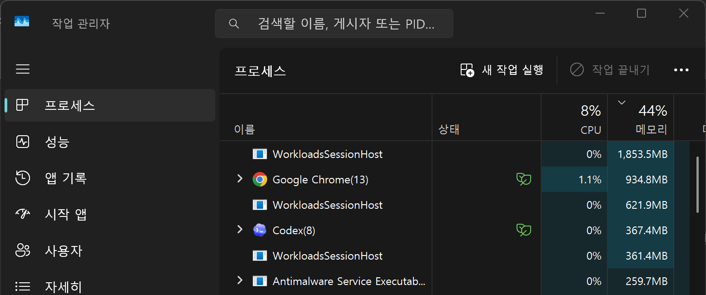
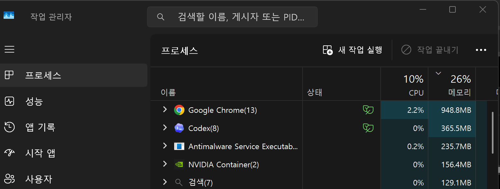

# Copilot AI Memory Saver

> Keep Win+Q. Stop Copilot AI from eating your RAM.

[](#requirements)
[](#install)
[](#install)
[](LICENSE)

Copilot AI Memory Saver keeps Windows 11 Click to Do available on Win+Q, while preventing Windows AI Fabric, WorkloadsSessionHost, AIXHost, and related Copilot+ workloads from staying in memory when idle.

This is for people who want to keep `Win + Q / Click to Do`, but do **not** want `WSAIFabricSvc`, `WorkloadsSessionHost`, `AIXHost`, and related Copilot+ background workloads sitting in RAM all the time.

It does **not** delete `WindowsWorkload.*` packages, patch `System32`, modify `WindowsApps`, or disable Windows Search.

## Security / Trust

- Requires **Administrator PowerShell** for install and uninstall
- Controls a Windows service and scheduled tasks on the local machine
- Does **not** remove system packages or patch system binaries
- Does **not** collect telemetry or ship embedded secrets
- Should be used carefully on work or school managed devices

Security notes and disclosure guidance: [SECURITY.md](SECURITY.md)

## At a Glance

- Keeps `Win + Q` working
- Starts Windows AI Fabric only when you actually invoke Click to Do
- Cleans up `ClickToDo.exe`, `AIXHost.exe`, `WorkloadsSessionHost.exe`, and `WorkloadsSessionManager.exe` after idle time
- Disables `WSAIFabricSvc` again after cleanup
- Installs with one PowerShell command path and uninstalls cleanly

## Screenshots

**Before cleanup**



**After cleanup**



## Quick Start

```powershell
Set-ExecutionPolicy -Scope Process Bypass -Force
.\install.ps1
```

That is the full install path. Run it from an elevated Windows PowerShell window in this folder.

## Before / During / After

| State | Target processes | Target memory | WSAIFabricSvc | Task Manager view |
| --- | ---: | ---: | --- | --- |
| Before cleanup | 6 | 5,789.2 MB peak | Running | About 44% memory used |
| During Win+Q use | 6 | High, temporary | Running on demand | Temporary increase |
| After watchdog cleanup | 0-1 residual handles | 94 MB | Stopped / Disabled | About 26% memory used |

Measured reclaimed memory: `5,695.2 MB`  
Measured reduction vs target processes: `98.4%`  
Approximate reduction vs 32 GB total RAM: `17.4%`

Reference outlier: one abnormal idle case showed `10` `WorkloadsSessionHost` processes holding about `7.9 GB`, roughly `24%` of a 32 GB machine. This repository does **not** claim that every machine will recover that much memory. These are measured examples, not promises.

## If You Searched for This

If you searched for WorkloadsSessionHost high memory, WSAIFabricSvc using RAM, Windows AI Fabric disable, Copilot AI memory usage, Copilot+ PC memory bloat, disable Copilot but keep Win+Q, or Click to Do memory usage, this project is for you.

## Requirements

- Windows 11 system where `Click to Do` already exists
- Copilot+ / Windows AI workload components already installed by Windows
- Windows PowerShell 5.1 or later
- Administrator PowerShell for install and uninstall
- AutoHotkey v2
  - `install.ps1` will try to install it with `winget` if missing

## What It Installs

`install.ps1` sets up:

- `%LOCALAPPDATA%\ArtemisClickToDo\Start-ClickToDo-Backend.ps1`
- `%LOCALAPPDATA%\ArtemisClickToDo\Watchdog-ClickToDo-Cleanup.ps1`
- `%LOCALAPPDATA%\ArtemisClickToDo\WinQ-ClickToDo-OnDemand.ahk`
- `%LOCALAPPDATA%\ArtemisClickToDo\AutoHotkey.exe`
- Scheduled task: `Artemis_CTD_Start`
- Scheduled task: `Artemis_CTD_Watchdog`
- Startup shortcut: `Artemis WinQ ClickToDo.lnk`

## Install

Open **Windows PowerShell as Administrator** in this repository folder and run:

```powershell
Set-ExecutionPolicy -Scope Process Bypass -Force
.\install.ps1
```

What the installer does:

1. Verifies administrator privileges.
2. Verifies AutoHotkey v2 and installs it with `winget` if missing.
3. Copies the runtime scripts to `%LOCALAPPDATA%\ArtemisClickToDo`.
4. Removes older `Artemis_CTD_Start`, `Artemis_CTD_Cleanup`, and `Artemis_CTD_Watchdog` tasks if present.
5. Stops currently running `ClickToDo.exe`, `AIXHost.exe`, `WorkloadsSessionHost.exe`, and `WorkloadsSessionManager.exe`.
6. Sets `WSAIFabricSvc` to `Disabled` and stops it.
7. Registers the start and watchdog scheduled tasks.
8. Adds an AutoHotkey startup shortcut.
9. Starts the watchdog and the Win+Q launcher immediately.

## How to Use

After install:

1. Press `Win + Q`.
2. Click to Do should open normally.
3. When you stop using it, the watchdog waits `30` seconds by default.
4. After idle timeout, it cleans the Click to Do process chain and disables `WSAIFabricSvc` again.

Detailed flow: [docs/how-it-works.md](docs/how-it-works.md)

## Pause Without Uninstalling

If you want to stop the tool temporarily but keep it installed:

```powershell
schtasks.exe /End /TN "Artemis_CTD_Watchdog"
Get-CimInstance Win32_Process | Where-Object {
    $_.Name -match "^AutoHotkey" -and $_.CommandLine -match "WinQ-ClickToDo-OnDemand.ahk"
} | ForEach-Object {
    Stop-Process -Id $_.ProcessId -Force
}
```

If you also want to stop the current backend state immediately:

```powershell
Remove-Item "$env:LOCALAPPDATA\ArtemisClickToDo\ctd_open.flag" -ErrorAction SilentlyContinue
taskkill.exe /F /T /IM ClickToDo.exe
taskkill.exe /F /T /IM AIXHost.exe
taskkill.exe /F /T /IM WorkloadsSessionHost.exe
taskkill.exe /F /T /IM WorkloadsSessionManager.exe
sc.exe stop WSAIFabricSvc
sc.exe config WSAIFabricSvc start= disabled
```

## Resume After Pause

To turn the tool back on without reinstalling:

```powershell
Start-Process "$env:LOCALAPPDATA\ArtemisClickToDo\AutoHotkey.exe" -ArgumentList "`"$env:LOCALAPPDATA\ArtemisClickToDo\WinQ-ClickToDo-OnDemand.ahk`""
schtasks.exe /Run /TN "Artemis_CTD_Watchdog"
```

## Uninstall

Remove the startup shortcut, scheduled tasks, runtime folder, and AutoHotkey launcher:

```powershell
.\uninstall.ps1
```

If you also want Windows AI Fabric restored to `Automatic` and started immediately:

```powershell
.\uninstall.ps1 -RestoreWindowsAI
```

## Verify It Is Working

Check service and task state:

```powershell
Get-Service WSAIFabricSvc
Get-ScheduledTask Artemis_CTD_Start,Artemis_CTD_Watchdog
```

Check runtime logs:

```powershell
Get-Content "$env:LOCALAPPDATA\ArtemisClickToDo\start.log" -Tail 50
Get-Content "$env:LOCALAPPDATA\ArtemisClickToDo\watchdog.log" -Tail 50
```

Check process memory:

```powershell
Get-Process WorkloadsSessionHost,WorkloadsSessionManager,AIXHost,ClickToDo -ErrorAction SilentlyContinue |
Select-Object Id,ProcessName,@{Name="RAM_MB";Expression={[math]::Round($_.WorkingSet64/1MB,1)}} |
Format-Table -Auto
```

## Why Not Just Disable Click to Do?

Because Click to Do itself can be useful. The problem is that Windows AI workloads can stay in memory after you stop using them. This repository keeps `Win + Q` available, but makes the backend behave like an on-demand component instead of an always-resident one.

## Safety Notes

- Does not remove `WindowsWorkload.*` packages
- Does not patch files under `System32` or `WindowsApps`
- Does not disable `WSearch`, `SearchHost.exe`, or `SearchIndexer.exe`
- Does not enable a `DisableClickToDo` policy by default
- Does not try to kill unrelated AutoHotkey scripts on your machine
- Targets only the known Click to Do / Windows AI Fabric process chain and the launcher installed by this project

Full notes: [docs/safety.md](docs/safety.md)  
Security policy: [SECURITY.md](SECURITY.md)

## Troubleshooting

- `Win + Q` does nothing: [docs/troubleshooting.md#win--q-does-not-open-click-to-do](docs/troubleshooting.md#win--q-does-not-open-click-to-do)
- `WorkloadsSessionHost` stays alive: [docs/troubleshooting.md#workloadssessionhost-stays-alive](docs/troubleshooting.md#workloadssessionhost-stays-alive)
- Watchdog is not running: [docs/troubleshooting.md#watchdog-is-not-running](docs/troubleshooting.md#watchdog-is-not-running)
- AutoHotkey is missing: [docs/troubleshooting.md#autohotkey-is-not-running](docs/troubleshooting.md#autohotkey-is-not-running)
- Tasks are not `Ready`: [docs/troubleshooting.md#scheduled-tasks-are-not-ready](docs/troubleshooting.md#scheduled-tasks-are-not-ready)
- `WSAIFabricSvc` comes back: [docs/troubleshooting.md#wsaifabricsvc-keeps-coming-back](docs/troubleshooting.md#wsaifabricsvc-keeps-coming-back)

## Benchmark

Test environment: `Windows 11 Copilot+ PC`, `32 GB RAM`

| Metric | Value |
| --- | ---: |
| Peak target-process memory during Win+Q use | 5,789.2 MB |
| Memory after cleanup | 94 MB |
| Reclaimed memory | 5,695.2 MB |
| Reduction vs target processes | 98.4% |
| Estimated reduction vs total 32 GB RAM | 17.4% |
| Task Manager total memory view | 44% -> 26% |

Benchmark details and a repeatable measurement snippet: [docs/benchmark.md](docs/benchmark.md)

## Known Limitations

- Windows updates may change service names, process names, or the Click to Do startup flow.
- Managed work or school PCs may block service control, scheduled tasks, or startup shortcuts.
- Memory savings vary by hardware, Windows build, installed `WindowsWorkload` packages, and whether your system is in a normal or abnormal resident-memory state.
- This is meant for systems where Click to Do already exists; it does not install Click to Do itself.

## Suggested GitHub Repo Description

Keep Win+Q / Click to Do, but stop Windows AI Fabric, WorkloadsSessionHost, AIXHost, and related Copilot+ workloads from sitting in RAM when idle.

## Suggested GitHub Topics

`windows-11`, `copilot`, `copilot-ai`, `copilot-plus`, `windows-ai`, `windows-ai-fabric`, `click-to-do`, `workloadssessionhost`, `wsaifabricsvc`, `memory-saver`, `debloat`, `powershell`, `autohotkey`

## Release Notes Draft

- Added an AutoHotkey v2 launcher that keeps `Win + Q` working
- Added an on-demand backend start flow for `WSAIFabricSvc`
- Added a watchdog cleanup flow for `ClickToDo.exe`, `AIXHost.exe`, `WorkloadsSessionHost.exe`, and `WorkloadsSessionManager.exe`
- Added clean uninstall and service-restore paths
- Added bilingual documentation, troubleshooting, safety notes, and benchmark guidance

## Korean Readme

Korean documentation: [README.ko.md](README.ko.md)
